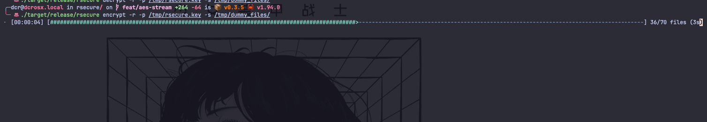

# rsecure

`rsecure` is a simple and secure command-line tool for AES-GCM file encryption and decryption, built in pure Rust. Ideal for protecting sensitive files, backups, and personal data.

> _Keep It Simple Stupid_

<p align="center" >
    
    
    
    
    
    
    
    
    
</p>

---



---

# Features

- 🔐 AES-256 GCM encryption & decryption
- 🚀 Fast & dependency-free (pure Rust)
- 🛡️ Safe key handling (keys never stored with data)
- 🖥️ Simple CLI interface
- 📦 Available on crates.io


# Installation

Using [`cargo`](https://rustup.rs/):

```bash
cargo install rsecure
```

Locally:

```bash
git clone https://github.com/containerscrew/rsecure.git
cd rsecure
cargo build --release
sudo cp ./target/release/rsecure /usr/local/bin/
```

# Usage

## Commands

| Command | Description |
|---------|-------------|
| `rsecure create-key -o /mnt/myusb/rsecure.key` | Generate a new AES-256 key and save it to a file |
| `openssl rand -out /mnt/myusb/rsecure.key 32` | Alternative: generate a random 256-bit key using OpenSSL |
| `rsecure encrypt -p /mnt/myusb/rsecure.key -s /tmp/mydirectory/text_to_encrypt.txt` | Encrypt a single file (`.enc` file is created in the same directory) |
| `rsecure encrypt -p /mnt/myusb/rsecure.key -s /tmp/mydirectory/files/` | Encrypt all files in a directory |
| `rsecure decrypt -p /mnt/myusb/rsecure.key -s /tmp/mydirectory/text_to_encrypt.txt.enc` | Decrypt a single encrypted file |
| `rsecure decrypt -p /mnt/myusb/rsecure.key -s /tmp/mydirectory/files/` | Decrypt all files in a directory |
| `rsecure encrypt -r -p ~/.keys/rsecure.key -s /tmp/rsecure/dirtoencrypt/` | Encrypt and **remove** original files |


> [!WARNING]
> Saving the key in the same local filesystem where you save the encrypted files is not a good idea.
> Save the key in a secure location, like a `USB drive` or a password manager.
> Or just save it in a `root owned directory` with strict permissions (will require sudo to use it).

> [!IMPORTANT]
> By default, `rsecure` will not delete the source plain files after encryption to avoid data loss.
> If you want to delete the source files after encryption, use `-r` flag.


# Local dev

Testing encryption and decryption:

```bash
mkdir -p /tmp/rsecure/dirtoencrypt
touch /tmp/rsecure/filetoencrypt.txt
echo 'please, hack me!' > /tmp/rsecure/filetoencrypt.txt
for i in {1..10}; do
    head -c 100 /dev/urandom | base64 > /tmp/rsecure/dirtoencrypt/file_$i.txt
done
```

```bash
rsecure create-key -o ~/.keys/rsecure.key
rsecure encrypt -p ~/.keys/rsecure.key -s /tmp/rsecure/filetoencrypt.txt
rsecure decrypt -p ~/.keys/rsecure.key -s /tmp/rsecure/filetoencrypt.txt.enc
#
rsecure encrypt -p ~/.keys/rsecure.key -s /tmp/rsecure/dirtoencrypt/
rsecure decrypt -p ~/.keys/rsecure.key -s /tmp/rsecure/dirtoencrypt/
```

# License

**`rsecure`** is distributed under the terms of the [GPL3](./LICENSE-GPL3) license.
