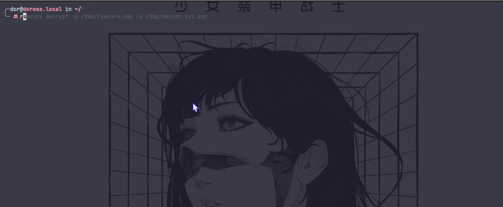

# rsecure

`rsecure` is a simple and secure command-line tool for AES-256-GCM file encryption and decryption, built in pure Rust. You can use either a 32-byte key file (default) or a passphrase (Argon2id) as the credential. Each file is then encrypted under a unique per-file subkey derived via HKDF-SHA256, eliminating any practical risk of nonce collision across files. Ideal for protecting sensitive files, backups, and personal data.

`rsecure` uses `stream` encryption and `rayon` parallelism. The speed of the encryption also depends of your hardware specs (disk speed, CPU speed and number of cores).

> [!IMPORTANT]
> **Post-quantum is a design goal, not a certification.** `rsecure` is deliberately built on symmetric primitives only — no RSA, no ECDH, no ECDSA, no X25519 — so there is no asymmetric surface for Shor's algorithm to break. AES-256 and SHA-256 are only reduced to ~128-bit security by Grover's algorithm, comfortably above the standard threshold, and AES-256 is part of NSA CNSA 2.0's post-quantum symmetric baseline. This shapes the direction of the project; it is **not** a formal PQ certification. See [Post-Quantum posture](#post-quantum-posture) and [`SECURITY.md`](./SECURITY.md#post-quantum-considerations) for the honest caveats.

<p align="center" >
    <a href="https://github.com/containerscrew/rsecure/actions/workflows/ci-cd.yml"></a>
    <a href="./CHANGELOG.md"></a>
    
    
    
    
    
    
    
    
    
    
    
</p>

---



---

## Quickstart

```bash
# 1. Install
curl --proto '=https' --tlsv1.2 -sSfL https://raw.githubusercontent.com/containerscrew/rsecure/main/install.sh | sh

# 2. Generate a demo key (for real use, store the key on a USB drive or password manager!)
rsecure create-key -o /tmp/rsecure.key

# 3. Create a test file
echo "hello rsecure" > /tmp/secret.txt

# 4. Encrypt it (-r removes the plaintext after encryption)
rsecure encrypt -p /tmp/rsecure.key -s /tmp/secret.txt -r

# 5. Peek at the ciphertext — nothing recognizable, just the RSEC header + AES-GCM bytes
cat /tmp/secret.txt.enc          # binary garble; use `xxd /tmp/secret.txt.enc | head` for a clean hex view

# 6. Decrypt it back (-r also removes the .enc after successful decrypt)
rsecure decrypt -p /tmp/rsecure.key -s /tmp/secret.txt.enc -r
```

> [!WARNING]
> If you lose the key, the encrypted data is unrecoverable. Read the [Security](#security) section before storing real data.

## Installation

### Universal install script

```shell
curl --proto '=https' --tlsv1.2 -sSfL https://raw.githubusercontent.com/containerscrew/rsecure/main/install.sh | sh
```

Pin a specific release by appending `-s -- -v <version>`:

```shell
curl --proto '=https' --tlsv1.2 -sSfL https://raw.githubusercontent.com/containerscrew/rsecure/main/install.sh | sh -s -- -v <version>
```

> [!NOTE]
> The installation script automatically detects your `OS` and `ARCH` and installs the correct binary (rpm, deb, apk, or just a binary in `/usr/local/bin`). On Alpine, install `apk add gcompat` since the binary is built with `glibc` and Alpine uses `musl`.

### AUR (Arch Linux)

```bash
paru -S rsecure # or yay -S rsecure
```

### Homebrew

```bash
brew install containerscrew/tap/rsecure
```

> [!NOTE]
> If you installed an older version via `brew install --cask rsecure`, run `brew uninstall --cask rsecure` first — `rsecure` is now distributed as a Homebrew formula, which avoids the macOS Gatekeeper quarantine that affected the cask.

### Using [`cargo`](https://rustup.rs/)

```bash
cargo install rsecure
cargo install rsecure --version <version>   # pin a specific release
```

### Local build

```bash
git clone https://github.com/containerscrew/rsecure.git
cd rsecure
cargo build --release
sudo cp ./target/release/rsecure /usr/local/bin/
```

## Usage

### Commands

| Command                                                                                  | Description                                                          |
| ---------------------------------------------------------------------------------------- | -------------------------------------------------------------------- |
| `rsecure create-key -o /mnt/myusb/rsecure.key`                                           | Generate a new AES-256 key and save it to a file                     |
| `openssl rand -out /mnt/myusb/rsecure.key 32`                                            | Alternative: generate a random 256-bit key using OpenSSL             |
| `rsecure encrypt -p /mnt/myusb/rsecure.key -s /home/mydirectory/text_to_encrypt.txt`     | Encrypt a single file (`.enc` file is created in the same directory) |
| `rsecure encrypt -p /mnt/myusb/rsecure.key -s /home/mydirectory/files/`                  | Encrypt all files in a directory                                     |
| `rsecure decrypt -p /mnt/myusb/rsecure.key -s /home/mydirectory/text_to_encrypt.txt.enc` | Decrypt a single encrypted file                                      |
| `rsecure decrypt -p /mnt/myusb/rsecure.key -s /home/mydirectory/files/`                  | Decrypt all files in a directory                                     |
| `rsecure encrypt -r -p /mnt/myusb/rsecure.key -s /home/rsecure/dirtoencrypt/`            | Encrypt and **remove** original files (plain text)                   |
| `rsecure encrypt -p /mnt/myusb/rsecure.key -s /home/rsecure/dirtoencrypt -e '.git'`      | Encrypt all files in a directory excluding `.git/` files             |
| `rsecure encrypt --passphrase -s /home/mydirectory/text_to_encrypt.txt`                  | Encrypt with a passphrase (Argon2id), no key file needed             |
| `rsecure encrypt --passphrase --argon2-memory 65536 --argon2-time 3 -s <path>`           | Tune Argon2id cost (memory in KiB, iterations, `--argon2-parallelism` for lanes) |
| `rsecure decrypt -s /home/mydirectory/text_to_encrypt.txt.enc`                           | Decrypt a passphrase-encrypted file (auto-detected, prompts for it)  |

> [!WARNING]
> Saving the key in the same local filesystem where you save the encrypted files is not a good idea.
> Save the key in a secure location, like a `USB drive` or a password manager.
> Or just save it in a `root owned directory` with strict permissions (will require sudo to use it).

Something like:

```bash
sudo rsecure encrypt -p /root/rsecure.key -s /home/dcr/Documents/PrivateDocuments -r
```

> `rsecure` must be in a PATH directory where `root` user can execute it. Which means, if you installed it using `cargo`, you need to add `~/.cargo/bin` to the `PATH` variable in the `root` user environment. Or just copy the binary to `/usr/local/bin/` or any other directory in the `PATH`.

> [!IMPORTANT]
> By default, `rsecure` will not delete the source plain files after encryption to avoid data loss.
> If you want to delete the source files after encryption, use `-r` flag.

## Security

`rsecure` encrypts file contents with **AES-256-GCM** via the audited [`aes-gcm`](https://crates.io/crates/aes-gcm) crate from [RustCrypto](https://github.com/RustCrypto), using the STREAM construction (`EncryptorBE32`) over 128 KiB chunks. For each file, a 32-byte random salt is generated and a unique AES-256 subkey is derived from the master key via [HKDF-SHA256](https://crates.io/crates/hkdf), so the `(key, nonce)` pair is globally unique and nonce-collision attacks against AES-GCM are not a concern in practice. Files written by rsecure ≤ 0.5.0 (no HKDF, 7-byte random nonce, no header) are still decrypted transparently — the `RSEC` magic header in new files distinguishes the two formats. The crate forbids `unsafe` code at the root (`#![forbid(unsafe_code)]`), and the dependency tree is continuously checked against the [RustSec Advisory Database](https://rustsec.org/) by `cargo-audit` and `cargo-deny` in CI.

Read [`SECURITY.md`](./SECURITY.md) for the full threat model — what `rsecure` does and does not protect against, the exact cryptographic parameters, and key custody guidance.

To report a vulnerability, please use [GitHub Security Advisories](https://github.com/containerscrew/rsecure/security/advisories/new) — do **not** open a public issue.

## Post-Quantum posture

`rsecure` is being developed with the intent of staying safe in a world where large-scale quantum computers exist. This is a **stated direction**, not a formal guarantee — the project is small, evolving, and has not undergone independent cryptanalytic review. Read this section for what that intent means in practice.

**Where the PQ story is genuinely strong:**

- **No asymmetric crypto anywhere.** rsecure does not use RSA, ECDH, ECDSA, or X25519. Shor's algorithm has nothing to break in the current design. This is the single biggest PQ risk in tools like `age`, `gpg`, or PGP — and rsecure sidesteps it by construction.
- **AES-256-GCM.** Grover's algorithm reduces AES-256's effective security from 256 to ~128 bits, comfortably above the standard 128-bit threshold. Approved as part of NSA CNSA 2.0's post-quantum symmetric baseline.
- **HKDF-SHA256** for per-file subkey derivation. Grover reduces preimage resistance from 256 to ~128 bits, still safe. rsecure does not use SHA-256 for long-lived signatures, so CNSA 2.0's preference for SHA-384/512 in signing contexts does not apply here.
- **Argon2id** for passphrase-mode master key derivation. Symmetric, memory-hard, unaffected by Shor; Grover only offers a √-speedup against the KDF.

**Where the PQ story has limits — be honest about these:**

- rsecure does not provide authenticated key exchange or key wrapping. If you distribute a keyfile to another party, the transport channel must be quantum-safe on its own — that is out of scope for this tool.
- Legacy on-disk formats (v1, v2) inherit the parameters of their era. The PQ posture applies to files produced by the current version (v3).
- Side-channel resistance is best-effort, inherited from `aes-gcm`. Not a PQ property, but worth stating alongside other honest caveats.
- No formal PQ certification exists for this implementation. NIST PQC categories describe primitives; they do not vouch for this specific codebase.

If future features ever require asymmetric crypto (for example, recipient-based encryption), the plan is to reach for NIST PQC standards (ML-KEM / ML-DSA) rather than pre-quantum primitives.

## Development

For a visual map of the internal call flow (CLI → key resolution → HKDF subkey →
AES-GCM STREAM), see [`docs/architecture.md`](./docs/architecture.md).

### Prerequisites

The Rust toolchain is pinned to a specific version in [`rust-toolchain.toml`](./rust-toolchain.toml),
so [`rustup`](https://rustup.rs/) will pick it up automatically when you `cd` into
the repo — no manual `rustup override` needed.

```bash
git clone https://github.com/containerscrew/rsecure.git
cd rsecure
cargo build                       # the pinned toolchain is installed on first build
```

Extra tooling used by the `Makefile` targets and the commit/release workflow:

```bash
cargo install cargo-nextest       # test runner used by `make test`
rustup component add clippy rustfmt
```

For contributing (commit hooks + release flow), also install:

- [`pre-commit`](https://pre-commit.com/) — runs the checks in [`.pre-commit-config.yaml`](./.pre-commit-config.yaml). After installing: `pre-commit install`.
- [`cocogitto`](https://docs.cocogitto.io/) (`cog`) — commits follow [Conventional Commits](https://www.conventionalcommits.org/) and are made with `cog commit <type> "<msg>" [scope]`. Enable the repo's git hooks with `cog install-hooks --all`.
- [`cargo-set-version`](https://crates.io/crates/cargo-edit) — only needed to cut a release (`cog bump --version X.Y.Z`).

### Common commands

The `Makefile` targets mirror what CI runs:

```bash
make test       # cargo nextest run
make lint       # cargo clippy -- -D warnings
make fmt        # cargo fmt --all
make ci         # fmt + lint + test (run this before pushing)
make build      # debug build
make release    # release build
```

### Optional AI-agent skills

A small set of project-scoped [Claude Code skills](https://skills.sh/) is pinned in
[`skills-lock.json`](./skills-lock.json). If you use an AI coding agent in this repo,
restore them with:

```bash
npx skills experimental_install
```

The downloaded skill files are git-ignored; only the lock file is committed. See
[`docs/skills.md`](./docs/skills.md) for details.

### Manual encrypt/decrypt testing

Testing encryption and decryption:

```bash
git clone https://github.com/containerscrew/rsecure.git
cd rsecure
sh scripts/fake_data.sh # will generate 17gb of fake data in /var/tmp/dummy_files/
rsecure encrypt -p /var/tmp/rsecure.key -s /var/tmp/dummy_files/
rsecure decrypt -p /var/tmp/rsecure.key -s /var/tmp/dummy_files/
```

> Edit the `fake_data.sh` script to create different types of files and directories for testing.

### Benchmark (hyperfine)

```bash
cargo install hyperfine
hyperfine --runs 5 'rsecure encrypt -p /var/tmp/rsecure.key -s /var/tmp/dummy_files/'
hyperfine --runs 5 'rsecure decrypt -p /var/tmp/rsecure.key -s /var/tmp/dummy_files/'
```

## License

`rsecure` is distributed under the terms of the [GPLv3](./LICENSE) license.
