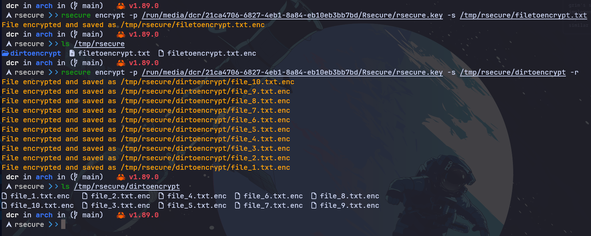

> [!NOTE]
> Starting in version `0.3.2`, new binaries will be published for: `apt`, `rpm`, `apk`, `pkg.tar.zst`, and `homebrew`. Avaibale for `darwin` and `linux` platforms and architectures `x86_64` and `aarch64`.

# rsecure

`rsecure` is a simple and secure command-line tool for AES-GCM file encryption and decryption, built in pure Rust. Ideal for protecting sensitive files, backups, and personal data.

> _Keep It Simple Stupid_

<p align="center" >
    
    
    
    
    
    
    
    
    
    
</p>

---



---

# Installation

## AUR (Arch Linux)

```bash
paru -S rsecure # or yay -S rsecure
```

## Homebrew

```bash
brew tap containerscrew/tap
brew install --cask rsecure
```

> [!WARNING]
> Since this binary is not signed by the Apple ecosystem, you will need to run the following command to allow it to run on your system.

```bash
xattr -d com.apple.quarantine /opt/homebrew/bin/rsecure
```

> If you still have issues running the binary, I recommend using the `cargo` installation method or downloading the binary from the [releases page](https://github.com/containerscrew/rsecure/releases).

> I will provide a custom script to do it automatically in the future.

## Using [`cargo`](https://rustup.rs/)

```bash
cargo install rsecure
```

## Locally

```bash
git clone https://github.com/containerscrew/rsecure.git
cd rsecure
cargo build --release
sudo cp ./target/release/rsecure /usr/local/bin/
```

# Usage

## Commands

| Command                                                                                 | Description                                                          |
| --------------------------------------------------------------------------------------- | -------------------------------------------------------------------- |
| `rsecure create-key -o /mnt/myusb/rsecure.key`                                          | Generate a new AES-256 key and save it to a file                     |
| `openssl rand -out /mnt/myusb/rsecure.key 32`                                           | Alternative: generate a random 256-bit key using OpenSSL             |
| `rsecure encrypt -p /mnt/myusb/rsecure.key -s /tmp/mydirectory/text_to_encrypt.txt`     | Encrypt a single file (`.enc` file is created in the same directory) |
| `rsecure encrypt -p /mnt/myusb/rsecure.key -s /tmp/mydirectory/files/`                  | Encrypt all files in a directory                                     |
| `rsecure decrypt -p /mnt/myusb/rsecure.key -s /tmp/mydirectory/text_to_encrypt.txt.enc` | Decrypt a single encrypted file                                      |
| `rsecure decrypt -p /mnt/myusb/rsecure.key -s /tmp/mydirectory/files/`                  | Decrypt all files in a directory                                     |
| `rsecure encrypt -r -p /mnt/myusb/rsecure.key -s /tmp/rsecure/dirtoencrypt/`            | Encrypt and **remove** original files (plain text)                   |
| `rsecure encrypt -p /mnt/myusb/rsecure.key -s /tmp/rsecure/dirtoencrypt -e '.git'`      | Encrypt all files in a directory excluding `.git/` files             |

> [!WARNING]
> Saving the key in the same local filesystem where you save the encrypted files is not a good idea.
> Save the key in a secure location, like a `USB drive` or a password manager.
> Or just save it in a `root owned directory` with strict permissions (will require sudo to use it).

Something like:

```bash
sudo rsecure encrypt -p /root/rsecure.key -s /home/dcr/Documents/PrivateDocuments -r
```

> [!IMPORTANT]
> By default, `rsecure` will not delete the source plain files after encryption to avoid data loss.
> If you want to delete the source files after encryption, use `-r` flag.

# Local dev

Testing encryption and decryption:

```bash
mkdir -p /tmp/rsecure/dirtoencrypt
touch /tmp/rsecure/filetoencrypt.txt
echo 'please, hack me!' > /tmp/rsecure/filetoencrypt.txt
for i in {1..10}; do
    head -c 100 /dev/urandom | base64 > /tmp/rsecure/dirtoencrypt/file_$i.txt
done
mkdir /tmp/rsecure/dirtoencrypt/.git/
touch /tmp/rsecure/dirtoencrypt/.git/ignoreme.txt
touch /tmp/rsecure/dirtoencrypt/.git/notthisfile.txt
```

```bash
rsecure create-key -o ~/.keys/rsecure.key
rsecure encrypt -p ~/.keys/rsecure.key -s /tmp/rsecure/filetoencrypt.txt
rsecure decrypt -p ~/.keys/rsecure.key -s /tmp/rsecure/filetoencrypt.txt.enc
#
rsecure encrypt -p ~/.keys/rsecure.key -s /tmp/rsecure/dirtoencrypt/
rsecure decrypt -p ~/.keys/rsecure.key -s /tmp/rsecure/dirtoencrypt/
rsecyre encrypt -p ~/.keys/rsecure.key -s /tmp/rsecure/dirtoencrypt/ -e '.git'
```

# TODO

- AUR package using `goreleaser` (source and bin)
- Share my public GPG key to verify the integrity of the binary releases

# License

**`rsecure`** is distributed under the terms of the [GPL3](./LICENSE-GPL3) license.
