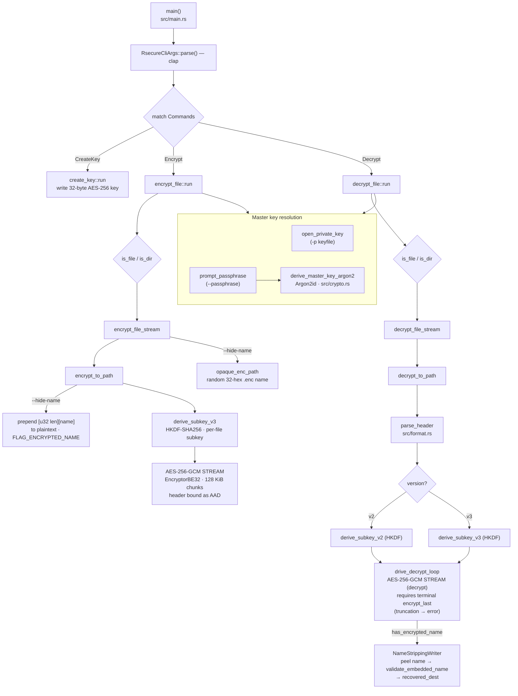

# Architecture

Visual map of how `rsecure` flows internally, from the CLI entry point down to the
AES-256-GCM STREAM core. Diagrams are [Mermaid](https://mermaid.js.org/) so GitHub
renders them inline and they version alongside the code.

> Keep these in sync with the source. They were derived from the call graph in
> `src/` — see [`AGENTS.md`](../AGENTS.md) for the module layout and
> [`SECURITY.md`](../SECURITY.md) for the cryptographic details and on-disk format.

## Call flow

High-level map of the calls: entry point → CLI parsing → subcommand dispatch → key
resolution (keyfile vs Argon2id passphrase) → per-file HKDF subkey → AES-GCM STREAM.



## Decrypt sequence

Temporal ordering of a single-file decrypt. The header is read first because it
carries the format version, the keyfile/passphrase flag, the HKDF salt, and (in
passphrase mode) the Argon2 parameters and salt needed to reconstruct the master key.

```mermaid
sequenceDiagram
    autonumber
    actor U as User
    participant M as main / clap
    participant R as decrypt_file::run
    participant F as file_ops
    participant H as format::parse_header
    participant K as crypto (Argon2id + HKDF)
    participant G as AES-256-GCM STREAM

    U->>M: rsecure decrypt -s file.enc [-p key | --passphrase]
    M->>R: dispatch Commands::Decrypt
    R->>F: is_file / is_dir (fan-out targets)

    loop each .enc file
        R->>H: parse_header(file)
        H-->>R: version, flags, hkdf_salt, argon2 params/salt
        Note over R,H: AAD = magic+version+flags+chunk_size+salt<br/>tampering fails the first GCM tag

        alt keyfile mode (-p)
            R->>F: open_private_key → master key
        else passphrase mode
            R->>F: prompt_passphrase
            F->>K: derive_master_key_argon2(pass, salt, params)
            K-->>R: master key (zeroized)
        end

        R->>K: derive_subkey_v2/v3(master_key, hkdf_salt)
        K-->>R: per-file AES-256 subkey
        R->>G: drive_decrypt_loop (128 KiB chunks)
        Note over R,G: stream must end on encrypt_last;<br/>EOF at a chunk boundary → truncation error
        G-->>R: plaintext chunks (verify tag per chunk)
        opt FLAG_ENCRYPTED_NAME set
            Note over R: NameStrippingWriter peels [u32 len][name],<br/>validate_embedded_name, restore original name
        end
        R->>F: fs::rename tmp → final ( -r removes .enc )
    end
```

## Regenerating these diagrams

The call structure is indexed in `codebase-memory`. To refresh after code changes,
re-index the repo and re-derive the flow with `trace_path` / `search_graph` rather
than editing the Mermaid by hand:

```text
index_repository(repo_path=".")
trace_path(function_name="main", direction="outbound", depth=4)
```
